# Case Study: Du Doan Benh Tim voi Data Mining (UCI Heart Disease)

## Thong tin Nhom
- Nhom: Nhom 02
- Thanh vien:
- Nguyen Hoa Binh
- Dinh Tan Phat
- Chu de: Du doan nguy co benh tim
- Dataset: UCI Heart Disease

## Muc tieu
Muc tieu cua nhom la:
> Xay dung he thong phan tich va du doan benh tim tu du lieu lam sang, so sanh hieu qua nhieu mo hinh hoc may, ket hop khai pha tri thuc va trien khai dashboard Streamlit de truc quan ket qua.

Muc tieu cu the:
- Xay dung pipeline end-to-end: load data -> preprocessing -> modeling -> evaluation -> visualization.
- So sanh 7 mo hinh supervised theo bo chi so: Accuracy, Precision, Recall, F1-Score, AUC-ROC, PR-AUC.
- Thu nghiem semi-supervised trong boi canh it du lieu nhan (5%, 10%, 20%, 30%).
- Bo sung nhom bai toan hoi quy de danh gia kha nang du doan chi so lien tuc.
- Trien khai dashboard Streamlit tong hop ket qua de demo.

## 1. Y tuong va Feynman Style
Noi de hieu:
- Bai toan can tra loi: "Benh nhan co nguy co benh tim hay khong?"
- Dau vao la thong tin kham benh thong thuong: tuoi, huyet ap, cholesterol, ECG, trieu chung khi gang suc.
- Mo hinh hoc may hoc tu du lieu lich su da co nhan de du doan cho benh nhan moi.
- Neu du doan som dung nguoi co nguy co cao, bac si co them thong tin de uu tien theo doi.

Tai sao phu hop:
- Dataset co nhan ro rang (`num`) va da duoc su dung rong rai trong bai toan hoc thuat.
- Co du mau de huan luyen, kiem tra va so sanh nhieu mo hinh.
- Co metric chuan de danh gia hieu qua tren tap test.

## 2. Quy trinh thuc hien
1) Load du lieu va kiem tra schema  
2) Lam sach, xu ly missing, encode va scale  
3) Chia train/test va can bang lop bang SMOTE  
4) Feature engineering va feature importance  
5) Khai pha du lieu: Association Rules, Clustering, Anomaly Detection  
6) Huan luyen supervised models + GridSearchCV  
7) Thu nghiem semi-supervised  
8) Danh gia tong hop + visualization  
9) Thu nghiem hoi quy  
10) Trien khai dashboard Streamlit

## 3. Dataset va preprocessing
### 3.1 Nguon du lieu
- Ten bo du lieu: UCI Heart Disease
- Nguon: https://archive.ics.uci.edu/ml/datasets/heart+disease
- Duong dan file: data/raw/heart_disease_uci.csv
- Quy mo: 920 mau, 16 cot (bao gom target)

### 3.2 Data Dictionary
| Cot | Mo ta |
|---|---|
| id | Ma dinh danh benh nhan |
| age | Tuoi |
| sex | Gioi tinh |
| dataset | Nguon benh vien con |
| cp | Loai dau nguc |
| trestbps | Huyet ap luc nghi (mmHg) |
| chol | Cholesterol huyet thanh (mg/dL) |
| fbs | Duong huyet luc doi > 120 mg/dL |
| restecg | Ket qua ECG luc nghi |
| thalch | Nhip tim toi da dat duoc |
| exang | Dau nguc khi gang suc |
| oldpeak | ST depression do gang suc |
| slope | Do doc doan ST |
| ca | So mach vanh duoc nhuom mau |
| thal | Ket qua thalassemia |
| num | Target goc 0-4 |

Target phan lop:
- num = 0 -> khong benh
- num > 0 -> co benh

### 3.3 Cac buoc preprocessing
- Xu ly missing values theo cot (sau xu ly: khong con missing).
- Nhi phan hoa target (`num > 0 => 1`).
- Encode bien phan loai (`sex`, `cp`, `fbs`, `restecg`, `exang`, `slope`, `thal`).
- Chuan hoa bien so bang StandardScaler.
- Chia train/test voi test_size = 0.2, seed = 42.
- Can bang lop train bang SMOTE.

### 3.4 Bieu do cho phan du lieu va preprocessing
Hinh 3.1 - Phan bo target

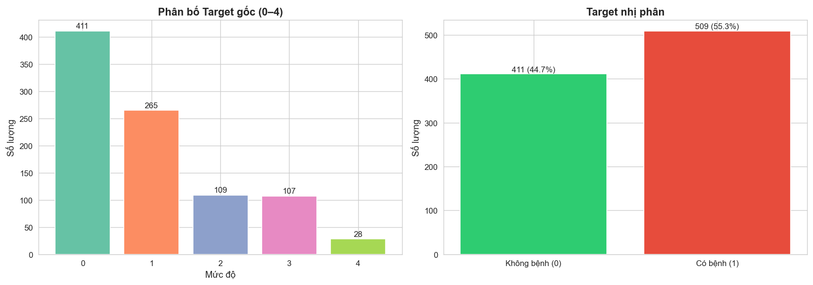

Hinh 3.2 - Phan bo bien so

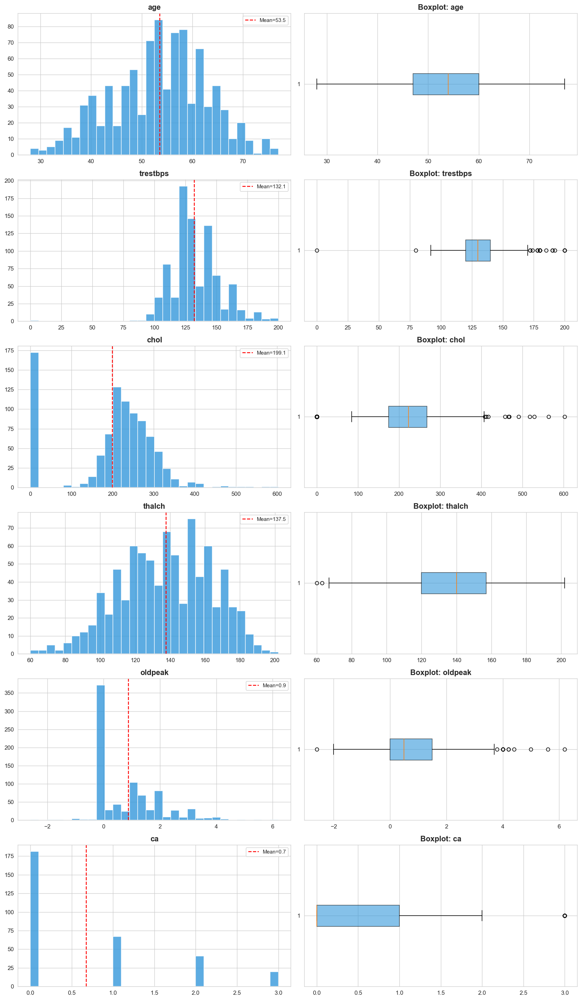

Hinh 3.3 - Phan bo bien phan loai

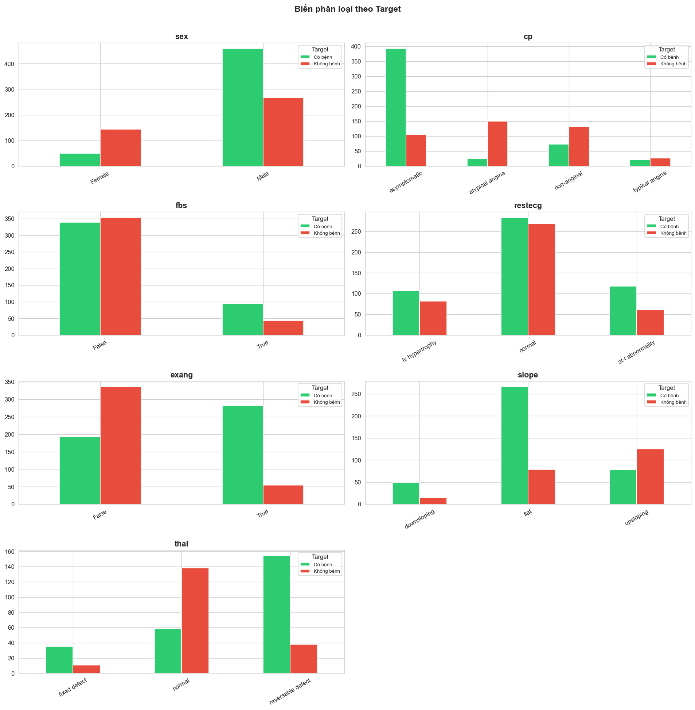

Hinh 3.4 - Ma tran tuong quan

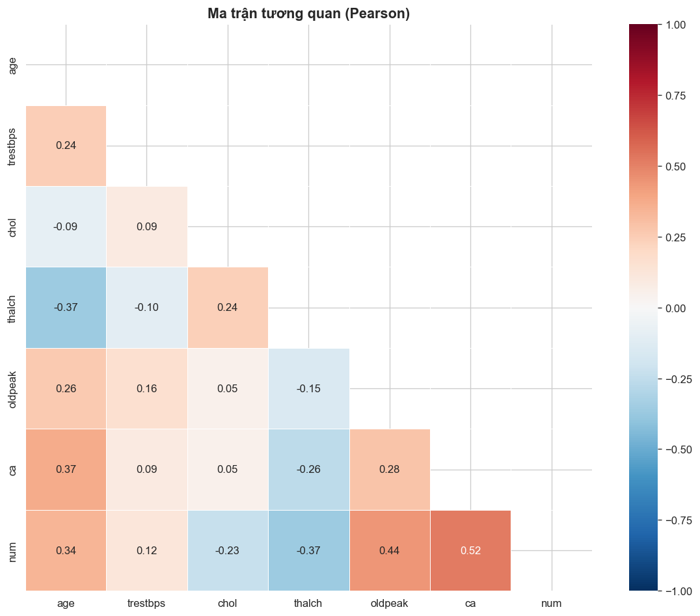

Hinh 3.5 - Bien so theo nhom benh/khong benh

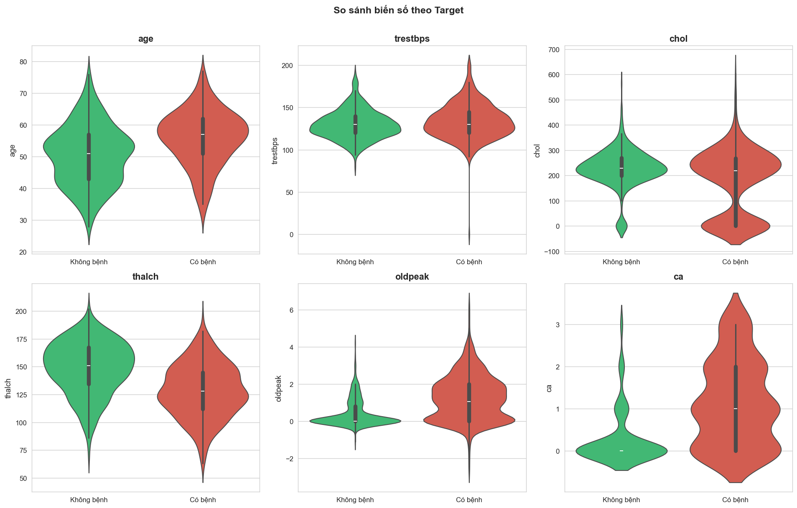

## 4. Khai pha du lieu (Data Mining)
### 4.1 Association Rules (Apriori)
- Muc tieu: tim cac mau ket hop giua trieu chung/chi so va tinh trang benh.
- Cau hinh:
  - min_support = 0.1
  - min_confidence = 0.6
- Ket qua: sinh duoc tap luat co lift > 2 cho thay mot so to hop trieu chung xuat hien manh.

Vi du luat lift cao:
- antecedents: atypical angina + False
- consequents: flat + no_disease + normal
- support = 0.1174
- confidence = 0.6353
- lift = 2.2308

### 4.2 Clustering
- Muc tieu: tim nhom benh nhan co profile giong nhau.
- Mo hinh: K-Means (thu k = 2..7) va DBSCAN.
- Ket qua: k = 4 cho chat luong cum tot nhat theo Silhouette/DBI trong khoang thu nghiem.

### 4.3 Anomaly Detection
- Muc tieu: phat hien benh nhan co profile bat thuong.
- Mo hinh: Isolation Forest, contamination = 0.05.
- Ket qua: phat hien cac diem anomaly de phuc vu canh bao so bo.

### 4.4 Bieu do cho phan khai pha du lieu
Hinh 4.1 - Ket qua phan cum

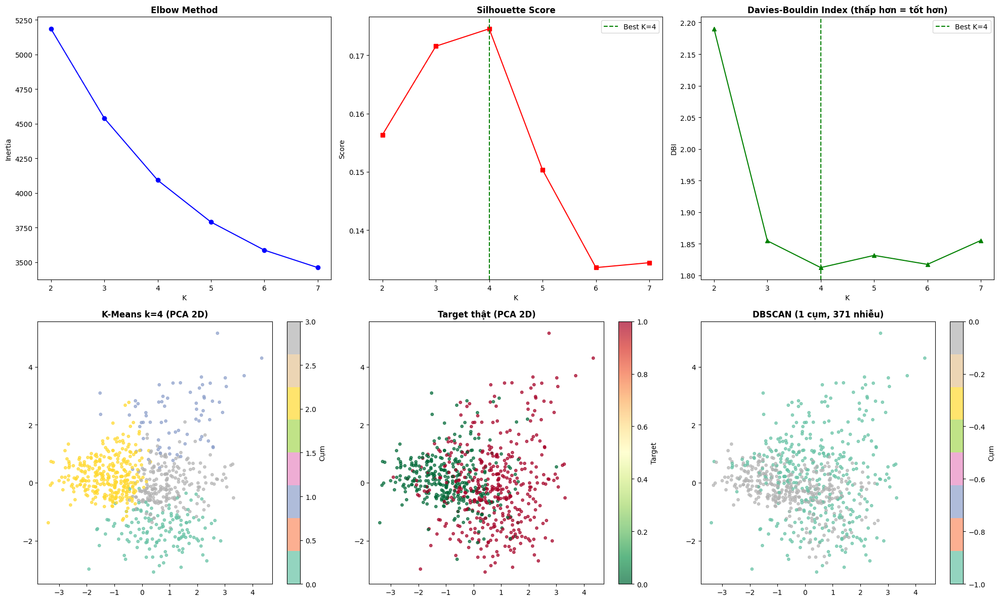

Hinh 4.2 - Phat hien bat thuong

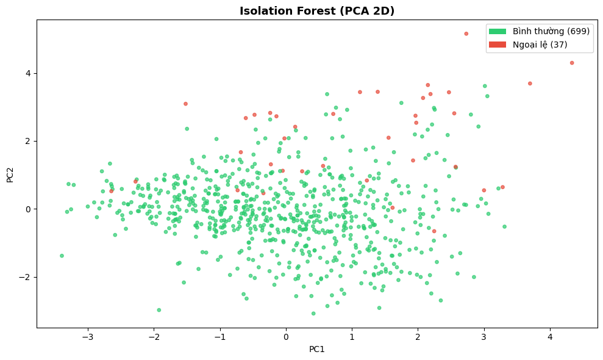

## 5. Mo hinh supervised va danh gia
### 5.1 Mo hinh thu nghiem
- LogisticRegression
- DecisionTree
- RandomForest
- SVM
- KNN
- GradientBoosting
- XGBoost

### 5.2 Ket qua tong hop supervised
Du lieu tu outputs/tables/model_comparison.csv

| Mo hinh | Accuracy | Precision | Recall | F1-Score | AUC-ROC | PR-AUC |
|---|---:|---:|---:|---:|---:|---:|
| GradientBoosting | 0.8533 | 0.8641 | 0.8725 | 0.8683 | 0.9058 | 0.9068 |
| SVM | 0.8424 | 0.8349 | 0.8922 | 0.8626 | 0.9150 | 0.9265 |
| XGBoost | 0.8424 | 0.8544 | 0.8627 | 0.8585 | 0.8996 | 0.8937 |
| RandomForest | 0.8315 | 0.8381 | 0.8627 | 0.8502 | 0.9218 | 0.9354 |
| KNN | 0.8261 | 0.8723 | 0.8039 | 0.8367 | 0.8990 | 0.9033 |
| LogisticRegression | 0.8098 | 0.8252 | 0.8333 | 0.8293 | 0.8868 | 0.9010 |
| DecisionTree | 0.7880 | 0.8119 | 0.8039 | 0.8079 | 0.7970 | 0.7746 |

Tom tat:
- Best theo F1: GradientBoosting (0.8683)
- Best theo Recall: SVM (0.8922)
- Best theo PR-AUC: RandomForest (0.9354)

### 5.3 Tham so toi uu va thoi gian train
Du lieu tu outputs/tables/model_training_results.csv

| Mo hinh | Best params | CV F1 mean | CV F1 std | Thoi gian (s) |
|---|---|---:|---:|---:|
| LogisticRegression | {C: 1} | 0.8061 | 0.0276 | 4.96 |
| DecisionTree | {max_depth: 10, min_samples_split: 5} | 0.7891 | 0.0142 | 0.29 |
| RandomForest | {max_depth: 10, min_samples_split: 2, n_estimators: 100} | 0.8388 | 0.0243 | 2.97 |
| SVM | {C: 1, kernel: rbf} | 0.8218 | 0.0363 | 0.47 |
| KNN | {n_neighbors: 7, weights: distance} | 0.8052 | 0.0372 | 0.10 |
| GradientBoosting | {learning_rate: 0.1, max_depth: 3, n_estimators: 200} | 0.8229 | 0.0341 | 1.92 |
| XGBoost | {learning_rate: 0.1, max_depth: 5, n_estimators: 100} | 0.8221 | 0.0323 | 0.47 |

### 5.4 Bieu do cho phan supervised
Hinh 5.1 - Bieu do so sanh metric

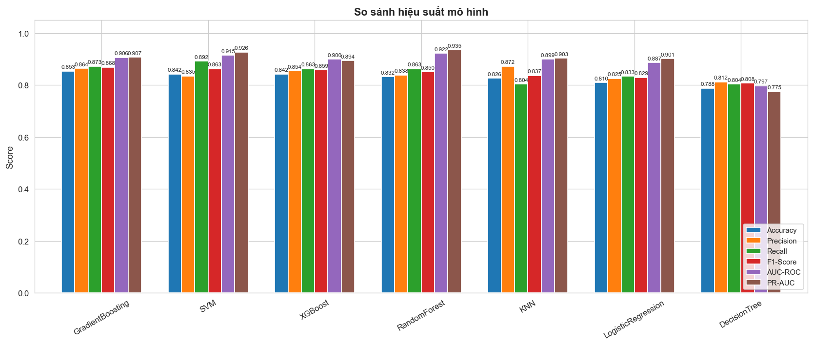

Hinh 5.2 - ROC curves

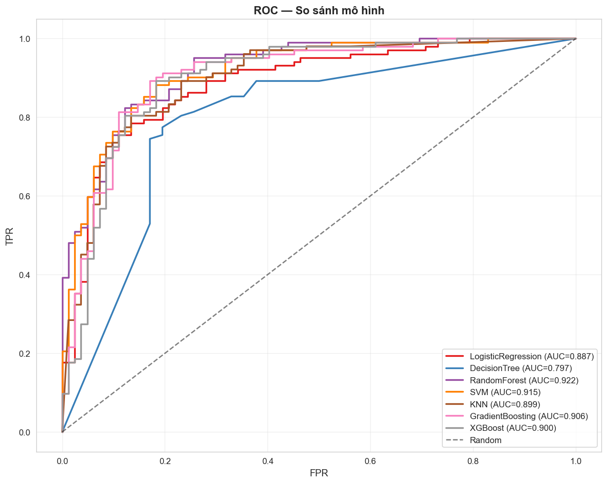

Hinh 5.3 - PR curves

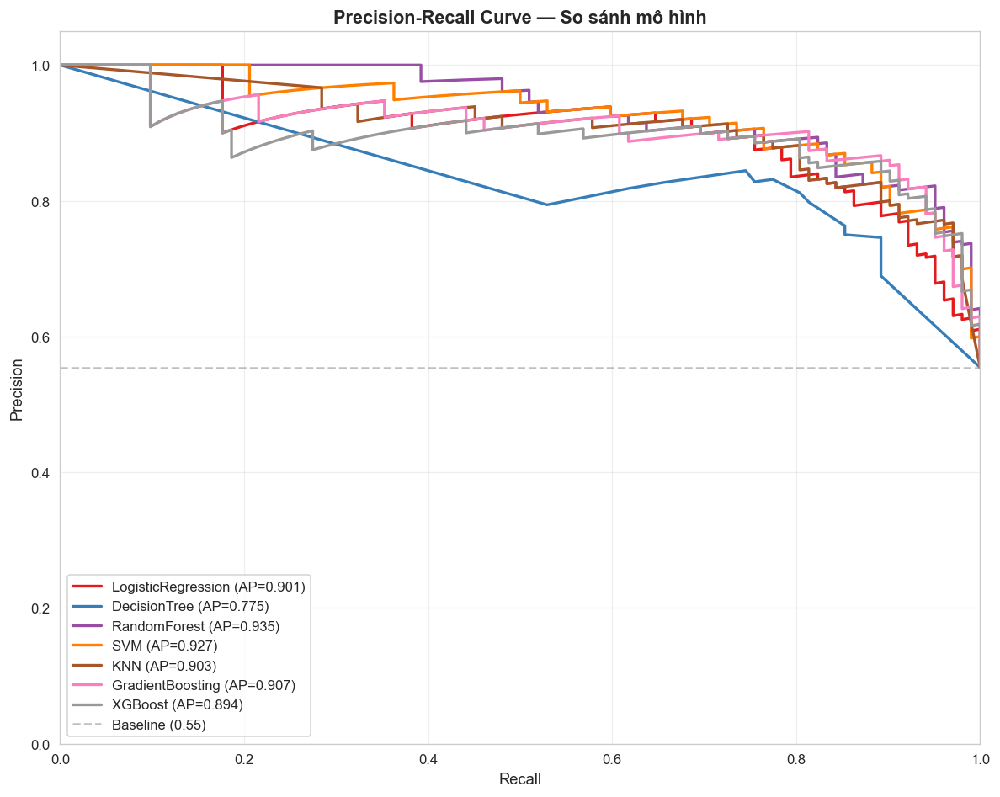

Hinh 5.4 - Confusion matrices

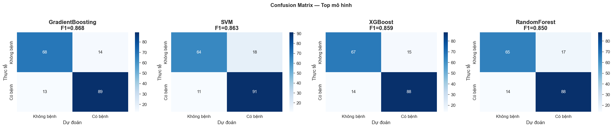

## 6. Semi-supervised learning
### 6.1 Cau hinh
- Ti le nhan: 5%, 10%, 20%, 30%
- Phuong phap:
  - Supervised-only
  - Self-Training
  - Label Spreading

### 6.2 Ket qua chinh
- Supervised-only nhin chung tot hon tren bo du lieu hien tai.
- Self-Training co Pseudo-label Acc dao dong: 65.4% -> 72.6%.
- Label Spreading nhanh nhung metric thap hon.

Diem cao nhat trong bang semi-supervised:
- Ty le nhan 20%, Supervised-only: F1 = 0.8597, PR-AUC = 0.9003

### 6.3 Bieu do cho phan semi-supervised
Hinh 6.1 - Learning curve semi-supervised

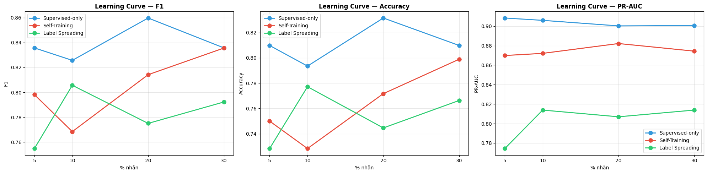

## 7. Bai toan hoi quy
### 7.1 Muc tieu
- Du doan `trestbps` (huyet ap luc nghi) de mo rong phan tich sang bai toan lien tuc.

### 7.2 Ket qua hoi quy
Du lieu tu outputs/tables/regression_results.csv

| Mo hinh | CV MAE mean | CV RMSE mean | Train MAE | Train RMSE |
|---|---:|---:|---:|---:|
| LinearRegression | 13.6911 | 17.9915 | 13.2168 | 17.5144 |
| Ridge | 13.6866 | 17.9879 | 13.2162 | 17.5144 |
| XGBRegressor | 15.5560 | 20.7926 | 5.4434 | 7.7925 |

Nhan xet:
- Ridge va LinearRegression on dinh hon tren CV.
- XGBRegressor co dau hieu overfit ro (chenh lech train va CV lon).

### 7.3 Bieu do cho phan hoi quy
Hinh 7.1 - Actual vs Predicted

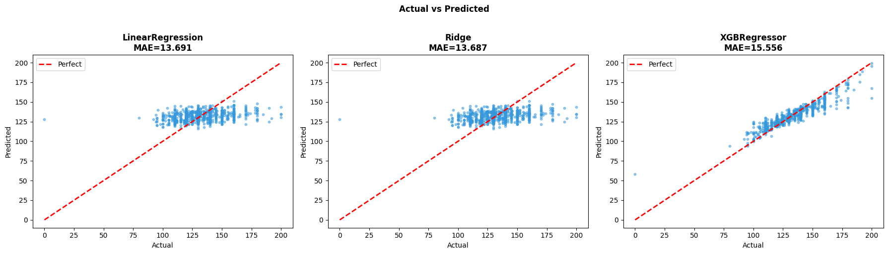

Hinh 7.2 - Residuals

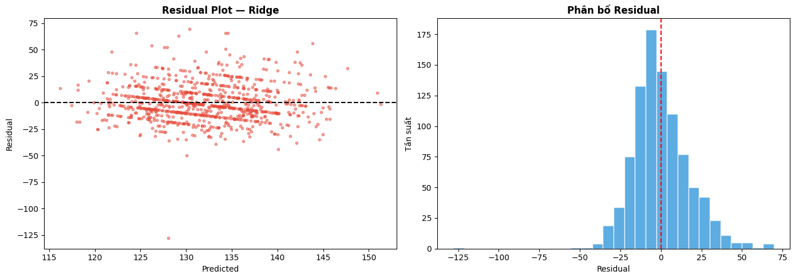

Hinh 7.3 - Feature Importance

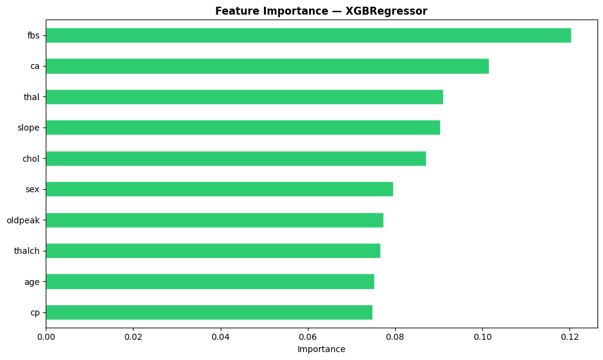

## 8. Dashboard Streamlit
File app: app.py

Dashboard gom 7 trang:
- Tong quan
- EDA
- Khai pha du lieu
- Mo hinh phan loai
- Semi-supervised
- Hoi quy
- Du doan truc tuyen

Tinh nang:
- Hien thi bang ket qua va bieu do cho tung phan.
- Loc association rules theo support, confidence, lift.
- So sanh semi-supervised theo tung ti le nhan.
- Form du doan online tu thong tin benh nhan.

## 9. Insight tong hop
Insight #1: GradientBoosting la lua chon can bang tot nhat theo F1-Score.  
Insight #2: SVM cho Recall cao nhat, phu hop muc tieu giam bo sot benh nhan.  
Insight #3: RandomForest co PR-AUC cao nhat, cho thay kha nang on dinh tren nhieu nguong.  
Insight #4: Semi-supervised chua vuot supervised-only trong boi canh du lieu hien tai.  
Insight #5: XGBRegressor overfit trong bai toan hoi quy, can regularization/manh tay hon.

## 10. Ket luan va de xuat
Ket luan:
- Pipeline da hoan thien va tai lap duoc ket qua.
- Du an da bao phu day du: EDA, mining, supervised, semi-supervised, regression, dashboard.

De xuat phat trien tiep:
- Threshold tuning theo muc tieu y te (uu tien Recall/FN).
- Calibration xac suat cho mo hinh phan lop.
- Ensemble/stacking de cai thien do on dinh.
- Bo sung du lieu ngoai (external validation) neu co.

## 11. Huong dan chay nhanh
### 11.1 Cai dat
```bash
pip install -r requirements.txt
```

### 11.2 Chay pipeline tong
```bash
python scripts/run_pipeline.py
```

### 11.3 Chay Streamlit
```bash
streamlit run app.py
```
Mac dinh mo tai: http://localhost:8501

## 12. Cau truc thu muc
```
BTL-DATAMINING/
|-- app.py
|-- configs/
|   `-- params.yaml
|-- data/
|   |-- raw/
|   `-- processed/
|-- notebooks/
|   |-- 01_eda.ipynb
|   |-- 02_preprocess_feature.ipynb
|   |-- 03_mining_or_clustering.ipynb
|   |-- 04_modeling.ipynb
|   |-- 04b_semi_supervised.ipynb
|   |-- 05_evaluation_report.ipynb
|   `-- 06_regression.ipynb
|-- outputs/
|   |-- figures/
|   |-- tables/
|   `-- models/
|-- scripts/
|   `-- run_pipeline.py
|-- src/
|   |-- data/
|   |-- features/
|   |-- mining/
|   |-- models/
|   |-- evaluation/
|   `-- visualization/
|-- requirements.txt
`-- README.md
```

## 13. Link code, notebook, slide
- Repo: https://github.com/hoabinh04/Nhom02_DuDoanBenhTim
- Notebook: thu muc notebooks/
- Link slide: (bo sung)

## 14. Luu y
- Du an mang tinh hoc tap va ho tro phan tich.
- Khong su dung thay the chan doan y khoa chuyen nghiep.
